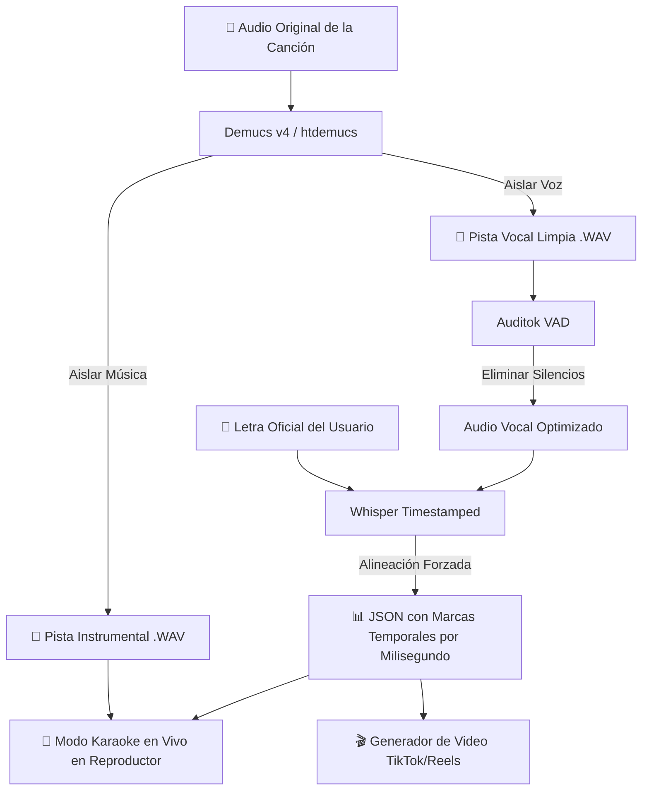

# 🎵 Music Lab

<p align="center">
  
  
  
  
  
  
</p>

<p align="center">
  <strong>Estación integral de producción musical, reproductor inmersivo HD y generador de videos reactivos con Inteligencia Artificial.</strong>
</p>

---

## 🌟 Descripción General

**Music Lab** es una plataforma web full-stack diseñada para amantes de la música, creadores de contenido y vocalistas. Combina un reproductor musical de estética *Glassmorphism* hiper-reactivo con potentes herramientas de inteligencia artificial para la separación de pistas, sincronización automática de letras a nivel de milisegundo y renderizado de videos dinámicos para redes sociales (TikTok, Reels, Shorts).

---

## 🚀 Características Principales

### 🎧 1. Reproductor Musical Inmersivo & Iluminación Acústica
* **Motor Visual HD Reactivo (Web Audio API):** Iluminación ambiental volumétrica que analiza el espectro sonoro en tiempo real (graves, medios, agudos, RMS y transitorios) generando ondas de luz, velos cromáticos y ráfagas de brillo cinemáticas sin penalizar el rendimiento (60 FPS estables).
* **Adaptación Cromática Automática:** Extrae dinámicamente la paleta de colores de la carátula de cada canción e ilumina la interfaz en consonancia.
* **Apagado Inteligente en Pausa:** Al pausar, el canvas se limpia y suspende por completo, garantizando 0% de consumo de CPU y una interfaz sobria.
* **Soundcheck & Calidad de Audio:** Medición de rango dinámico, balance tonal y herramientas de calibración de ganancia por pista.
* **Gestión de Biblioteca & Fichas:** Búsqueda en tiempo real, edición de metadatos ID3 (título, artista) y persistencia local.

### 🎤 2. Sincronización Automática de Karaoke por IA
* **Alineación Forzada (Forced Alignment):** Utiliza **Whisper Timestamped** para mapear fonemas con la letra escrita, detectando el milisegundo exacto de inicio y fin de cada palabra.
* **Aislamiento Vocal con Demucs (htdemucs):** Separa la pista vocal de la instrumental mediante redes neuronales convolucionales profundas para una sincronización inmune al ruido de fondo o baterías fuertes.
* **Detección de Actividad de Voz (VAD):** Emplea **Auditok** para descartar silencios y optimizar el procesamiento.
* **Modo Karaoke en Vivo:** Pantalla dividida con reproducción instrumental y resaltado dinámico de la letra sincronizada en tiempo real.

### 🎬 3. Generador de Videos Verticales (TikTok / Reels / Shorts)
* **Exportación en Alta Definición (1080x1920):** Renderizado de fragmentos seleccionados en MP4 con sincronización lírica precisa.
* **Múltiples Formatos Visuales:**
  * **Estilo Reproductor:** Estética *Glassmorphism* flotante con carátula, ecualizador reactivo y letra animada.
  * **Estilo Terminal:** Estética *Cyberpunk / Hacker* con arte ASCII (PyFiglet), fuentes monoespaciadas y trazas de consola.
* **Personalización Total:** Tipografías configurables, escalas de texto y temas de color.

### 🔍 4. Módulo Descubrir & Spotify Sync
* **Integración Spotify Web API:** Autenticación OAuth 2.0 para explorar canciones, álbumes y playlists populares.
* **Descarga Automática Multi-Fuente:** Descarga y conversión directa de audio a MP3 de alta fidelidad vía **yt-dlp** y **FFmpeg**.

---

## 🛠️ Tecnologías Utilizadas

| Capa / Dominio | Tecnologías | Propósito |
| :--- | :--- | :--- |
| **Frontend UI** | **Vanilla JavaScript (ES Modules)**, **HTML5 Semántico**, **CSS3 Moderno** | Arquitectura SPA reactiva sin dependencias pesadas, tokens de diseño y diseño *Glassmorphism*. |
| **Gráficos & Audio Web** | **Web Audio API**, **Canvas 2D Hardware-Accelerated** | Análisis FFT de 512 puntos, captura en tiempo real y renderizado de iluminación volumétrica a 60 FPS. |
| **Backend Core** | **Python 3.14+**, **FastAPI**, **Starlette**, **Uvicorn**, **Pydantic v2** | API REST asíncrona de alto rendimiento, gestión de colas de jobs en background y streaming de audio. |
| **Inteligencia Artificial** | **OpenAI Whisper**, **Whisper-Timestamped**, **PyTorch**, **Torchaudio** | Modelos de reconocimiento de voz y alineación temporal forzada de letras fonema a palabra. |
| **Procesamiento de Audio** | **Demucs v4 (htdemucs)**, **Auditok**, **SciPy**, **NumPy** | Separación de pistas (*source separation*), detección de actividad vocal (VAD) y transformada de Fourier. |
| **Motor de Video** | **MoviePy**, **Pillow (PIL)**, **ImageIO-FFmpeg**, **PyFiglet** | Dibujo cuadro a cuadro de elementos reactivos, tipografía dinámica y composición MP4. |
| **Herramientas & Extracción** | **yt-dlp**, **FFmpeg**, **Requests** | Descarga, demuxing y transcodificación de fuentes de audio online. |
| **Entorno & Paquetes** | **uv (Astral)** | Gestor de paquetes ultrarrápido y resolución determinista de dependencias (`uv.lock`). |

---

## 🧠 Arquitectura del Pipeline de Sincronización IA



---

## ⚙️ Instalación y Puesta en Marcha

### Prerrequisitos
* **Python 3.14+**
* [uv](https://docs.astral.sh/uv/) (Gestor de paquetes de Python recomendado)
* **FFmpeg** instalado y disponible en el `PATH` del sistema.

### 1. Clonar el Repositorio
```bash
git clone https://github.com/MichaelTaboada2003/music-lab.git
cd music-lab
```

### 2. Sincronizar Dependencias
Instala todas las dependencias bloqueadas en el entorno virtual mediante `uv`:
```bash
uv sync
```

### 3. Configuración de Entorno (Opcional para Spotify)
Crea un archivo `.env` en la raíz del proyecto si deseas usar la integración con Spotify:
```env
SPOTIFY_CLIENT_ID=tu_client_id
SPOTIFY_CLIENT_SECRET=tu_client_secret
SPOTIFY_REDIRECT_URI=http://127.0.0.1:8000/api/spotify/callback
```

### 4. Iniciar el Servidor
Puedes arrancar el backend con FastAPI:
```bash
uv run uvicorn app:app --reload
```

O iniciar con el lanzador automático que abre la aplicación en tu navegador:
```bash
uv run python music_lab.py
```

La aplicación estará disponible en `http://127.0.0.1:8000`.

---

## 📁 Estructura del Proyecto

```text
music-lab/
├── app/                        # Backend FastAPI
│   ├── config.py               # Rutas, directorios y variables de entorno
│   ├── jobs.py                 # Gestor de tareas asíncronas en background
│   ├── utils.py                # Funciones auxiliares de sanitización y formato
│   └── routers/                # Endpoints agrupados por dominio
│       ├── audio_quality.py    # Soundcheck y análisis de calidad
│       ├── frontend.py         # Servidor de vistas y biblioteca
│       ├── karaoke.py          # Separación vocal y sincronización
│       ├── songs.py            # Descarga, carátulas y metadatos
│       ├── spotify.py          # OAuth y búsqueda en Spotify
│       └── video.py            # Renderizado y exportación de video
├── static/                     # Frontend SPA (Vanilla JS + CSS)
│   ├── index.html              # Estructura principal
│   ├── style.css               # Sistema de diseño y Glassmorphism UI
│   └── js/                     # Módulos ES6
│       ├── api.js              # Cliente HTTP y polling de jobs
│       ├── discover.js         # Módulo de Spotify y recomendaciones
│       ├── karaoke.js          # Motor de letras en vivo
│       ├── lyrics.js           # Editor y gestor de letras
│       ├── main.js             # Punto de entrada de la SPA
│       ├── nav.js              # Enrutador por Hash
│       ├── player.js           # Lógica del reproductor y playlist
│       ├── studio.js           # Flujo de trabajo del estudio de video
│       └── visualizer.js       # Motor de iluminación acústica Web Audio API
├── tests/                      # Suite de pruebas automatizadas
│   ├── test_lyrics_sync.py     # Pruebas de alineación y VAD
│   └── test_tiktok_generator.py # Pruebas del renderizador de video
├── audio_downloader.py         # Extractor de audio vía yt-dlp
├── audio_quality.py            # Análisis de nivel sonoro y metadatos
├── library_artwork.py          # Extracción y redimensionado de carátulas
├── library_metadata.py         # Gestor de fichas técnicas JSON
├── lyrics_sync.py              # Pipeline Whisper + VAD + Alignment
├── music_lab.py                # Lanzador de escritorio
├── pyproject.toml              # Definición de dependencias y proyecto
└── tiktok_generator.py         # Motor de generación de video con PIL/MoviePy
```

---

## 🧪 Ejecución de Pruebas

Para ejecutar la suite de pruebas unitarias y de integración:
```bash
PYTHONPATH=. uv run pytest
```

---

## 📄 Licencia

Este proyecto está bajo la Licencia MIT. Consulta el archivo `LICENSE` para más detalles.
